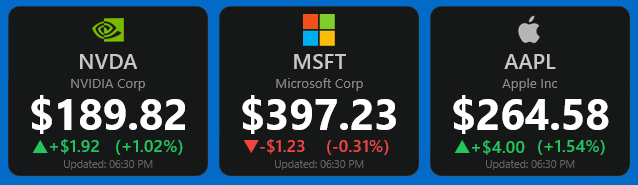

# 📈 Stock Ticker — Rainmeter Skin

A clean, minimal Rainmeter skin that displays live stock prices with real-time change indicators, sourced from CNBC's quote API.



---

## ✨ Features

- **Live stock price** — updates every 10 minutes via CNBC's JSON feed
- **Change indicators** — color-coded arrows (▲ / ▼) with price change and percentage
- **Company name** — auto-fetched and displayed below the ticker symbol
- **Optional logo** — supports per-ticker PNG images
- **Click to open** — left-click opens the CNBC quote page for the ticker
- **Last updated time** — shows the local time of the last refresh

---

## 📋 Requirements

- [Rainmeter](https://www.rainmeter.net/) 4.5 or later
- Windows 10 / 11
- Internet connection

---

## 🚀 Installation

1. Download the latest **`StockTicker.rmskin`** from the [Releases](../../releases) page.
2. Double-click the `.rmskin` file — the Rainmeter Skin Installer will open automatically.
3. Click **Install**. The skin will be copied to your skins folder and loaded automatically.

That's it! The skin should appear on your desktop immediately after installing.

> **Manual install (alternative):** If you prefer, you can clone this repo directly into your Rainmeter skins folder at `%USERPROFILE%\Documents\Rainmeter\Skins\StockTicker\`, then right-click the Rainmeter tray icon → **Refresh All** and load the skin from the Manage window.

---

## ⚙️ Configuration

All customization is done in the `[Variables]` section at the top of the `.ini` file. After making any changes, right-click the skin → **Refresh Skin** to apply them.

---

### `Ticker`
**Default:** `AAPL`

The stock ticker symbol to display. This must match the symbol used on CNBC/major US exchanges. The skin fetches both the price data and the company name automatically based on this value.

```ini
Ticker=AAPL     ; Apple Inc.
Ticker=MSFT     ; Microsoft
Ticker=NVDA     ; NVIDIA
Ticker=BTC.X    ; Bitcoin (CNBC format for crypto)
```

> **Note:** The ticker also controls which logo image is loaded from `@Resources\Images\`. For example, setting `Ticker=MSFT` will look for `MSFT.png`.

---

### `CurrencySymbol`
**Default:** `$`

The symbol prepended to the price and change values. Change this if you're tracking non-US stocks.

```ini
CurrencySymbol=$    ; US Dollar
CurrencySymbol=£    ; British Pound
CurrencySymbol=€    ; Euro
CurrencySymbol=¥    ; Japanese Yen
```

> **Note:** This only changes the displayed symbol - the actual price data still comes from CNBC in its original currency. It does not perform currency conversion.

---

### `FontName`
**Default:** `Segoe UI`

The font used for all text on the card (ticker, company name, price, change values, update time). Any font installed on your system can be used.

```ini
FontName=Segoe UI       ; Clean Windows default (recommended)
FontName=Arial
FontName=Roboto
FontName=JetBrains Mono ; Monospace option for a more technical look
```

---


---

## 🖼️ Adding a Logo

The skin supports an optional company logo displayed at the top of the card.

1. Add a **32×32 PNG** image named after the ticker symbol (e.g. `AAPL.png`) to:
   ```
   @Resources\Images\
   ```
2. Refresh the skin. If no image is found, the space is simply left empty.

---

## 📡 Data Source

Stock data is fetched from CNBC's public quote API:
```
https://quote.cnbc.com/quote-html-webservice/restQuote/symbolType/symbol?symbols=TICKER
```

Prices refresh every **10 minutes** (`UpdateRate=600`). To change this, edit the `UpdateRate` value in `[MeasureStock]` (value is in skin update cycles, with `Update=1000` meaning 1 second per cycle).

---

## 🗂️ File Structure

```
StockTicker/
├── StockTicker.ini       # Main skin file
├── @Resources/
│   └── Images/
│       └── AAPL.png      # Optional ticker logos (32x32 PNG)
└── README.md
```

---

## 📝 License

This project is released under the [MIT License](LICENSE).

---

## 🙏 Acknowledgements

- [Rainmeter](https://www.rainmeter.net/) — the desktop customization platform
- [CNBC](https://www.cnbc.com/) — stock data source
